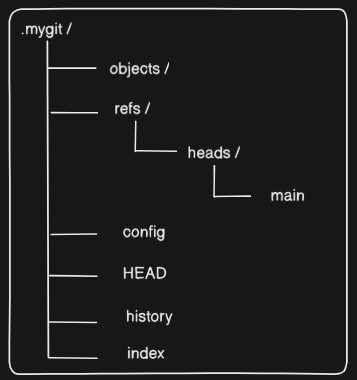
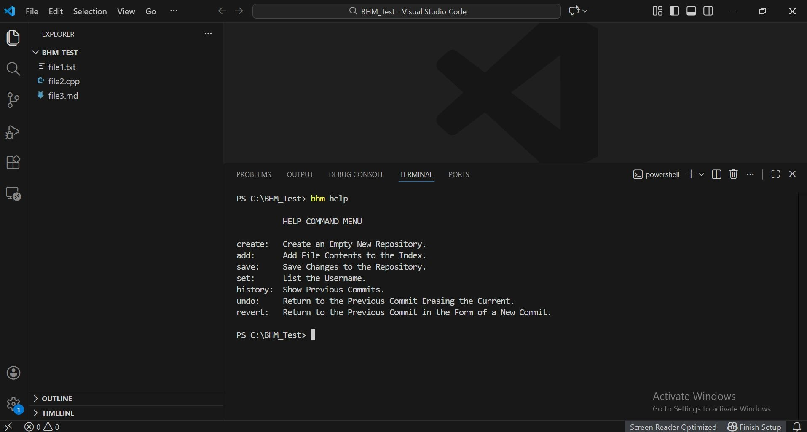
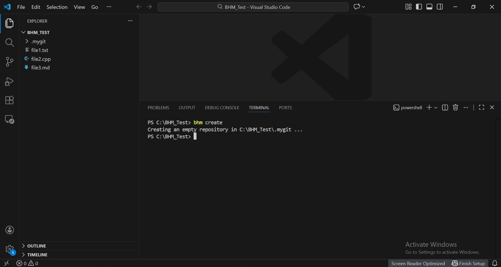
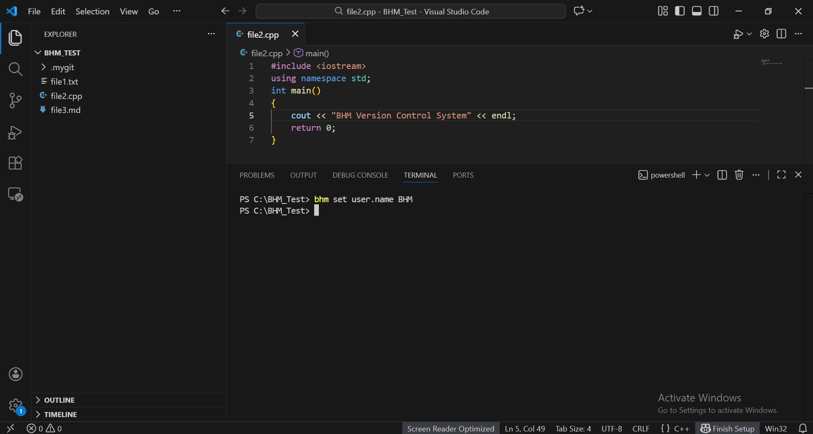
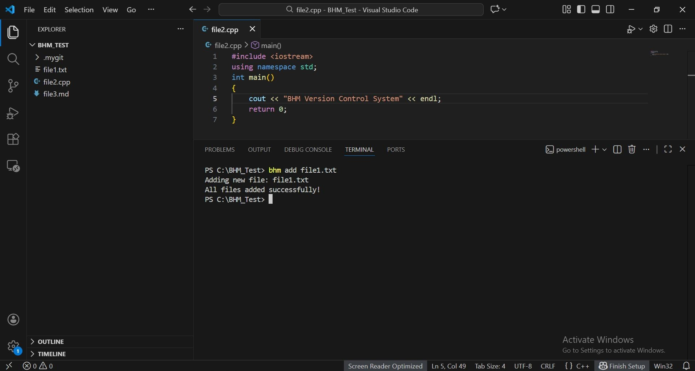
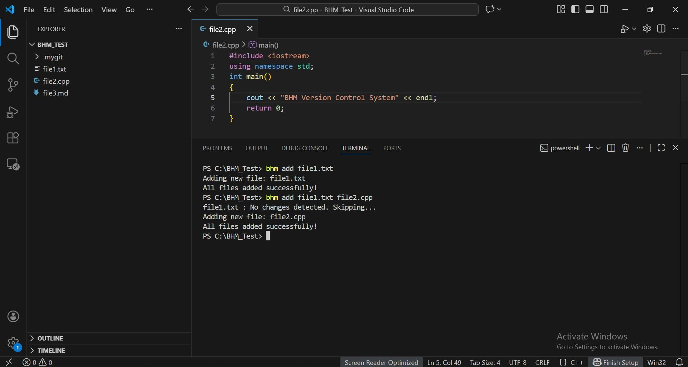
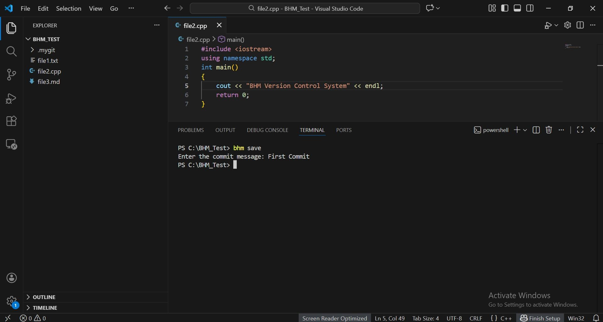
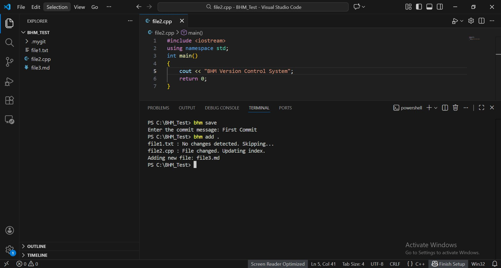
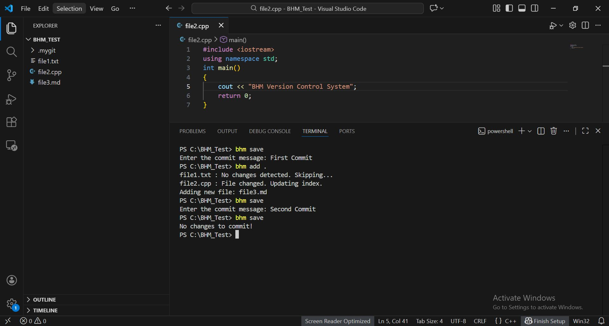
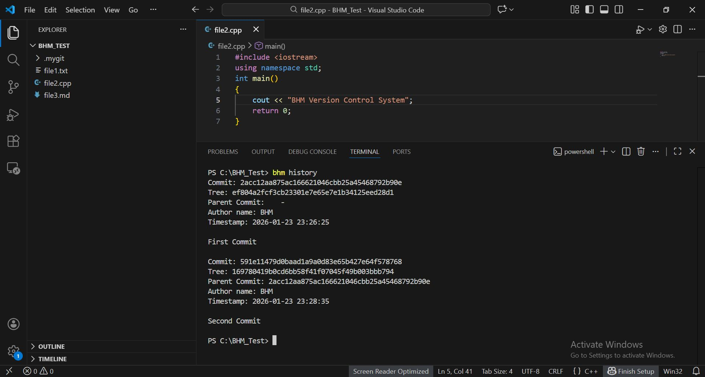

# BHM Version Control System

BHM is a console-based Version Control System (VCS) implemented in C++. It is inspired by git and supports basic functionalities like file tracking, saving changes, and managing history. The project is designed to help beginner developers understand the underlying working of modern and complex version control systems.

## Features

- Create a new repository
- Set author name for commits
- Add files to track changes
- Save versions of files
- View saved version history
- Undo changes when needed

## Project Structure

**main.cpp** - As the user types in a command, it is checked in the main function and directed to the appropriate function.

**functions.cpp** - It holds separate function for each command.

**sha1.h** - It is used each time to compute sha1 hash of files. 

**.mygit** - It is the internal directory used by BHM to store all version control data. It is automatically created and should not be edited manually.



* **objects/** stores blob, tree, and commit objects.
* **refs/heads/main** stores the hash of the latest commit on the main branch.
* **config** stores the configured author name.
* **HEAD** stores the reference to the main branch.
* **index** acts as a staging area to store filenames with blob hashes that have been added.

## Commands and Logic

### help
It displays the short description of each command. User is prompted to type this command each time a wrong command is entered.
```bash
bhm help
```



### create
Creates a new repository (a .mygit folder) in the current directory.
```bash
bhm create
```



#### Logic 
* Checks if a .mygit folder already exists in the current directory.
* If not, it creates the folder along with all necessary subfolders and files to store repository data.

### set
Configures the author name for the repository.
```bash
bhm set.username <name>
```


#### Logic 
* Accepts a user-provided name.
* Stores the author name in a configuration file.
* Associates the author name with future commits.

### add
Adds files to the staging area.
```bash
bhm add <filename>
```
**Adding a single file**



**Adding multiple files**



#### Logic 
* If the repository exists and the user has given at least one filename, it converts the existing files into strings, generates their hash, creates blob objects and updates the index file.
* Index file stores the filename and its blob hash.
* It only works for the files not added previously. If any added file is changed later before saving, the blob hash gets updated in the index.

### save
Creates a commit (permanent snapshot) of staged files.

```bash
bhm save
```

**First Commit**

 

Another command that can be entered is 
``` bash
bhm add .
```
This command adds all the files in the current directory.



**Second Commit**



#### Logic
* If the repository exists and the staging area (index file) is not empty, the current index file is converted into a string and its hash is computed.
* The hash of the current index (tree hash) is compared with the tree hash of the last commit to determine whether there are any unsaved changes.
* If changes exist, commit metadata is created, including the parent commit hash (from the main file), tree hash, author name (from the config file), timestamp, and commit message.
* The main and history files are updated using the newly generated commit hash and metadata.


### history
Shows the version history on the console.
```bash
bhm history
```


#### Logic 
* History file gets updated in the save command. 
* This command only displays the content of the history file.

## Features added in Version 2.0

### undo 
```bash
bhm undo
```

#### Logic 

* Finds the parent commit of the latest commit.
* Reads the tree file from that commit.
* Deletes files that are listed in that tree file.
* Recreates required files using stored file contents.

### undo save 
```bash
bhm undo save
```

#### Logic 

* Finds the parent commit of the previous commit.
* Reads the tree file from that commit.
* Deletes files that are listed in that tree file.
* Recreates required files using stored file contents.
* Updates the commit pointer and now points to the previous commit hash.
* Delete the commit object from the history file.


## Technology Used

**C++**  – Core programming language for implementing all functionality.

**Standard Template Library (STL)** – Used for containers (vector, string), stream handling (stringstream), and algorithms.

**File System Library (filesystem)** – Handles repository directories, file creation, deletion, and traversal.

**File I/O (fstream)** – For reading and writing files such as index, commit objects, history, and config.

**Hashing (SHA-1)** – Custom SHA-1 implementation used to generate unique object hashes for blobs, trees, and commits.

**Time Function (ctime)** – To generate timestamps for commits.

**Console Interface (iostream and iomanip)** – Command-line interface for interacting with the user and displaying formatted messages.

**Binary Encoding** – Converts files into binary for processing.

## Supported File Formats

With the binary conversion and Base64 encoding implementation, **BHM now supports virtually all file formats**:

### ✅ Text-Based Formats (Native Support)
| Format | Extension | Use Case |
|--------|-----------|----------|
| Plain Text | `.txt`, `.log`, `.md` | Documentation, logs, notes |
| Markdown | `.md`, `.markdown` | Documentation |
| Source Code | `.cpp`, `.h`, `.py`, `.java`, `.js`, `.ts`, `.c`, `.go`, `.rs` | Programming |
| Web Languages | `.html`, `.css`, `.scss`, `.xml` | Web development |
| Configuration | `.json`, `.yaml`, `.yml`, `.ini`, `.conf`, `.toml` | Config files |
| Data Files | `.csv`, `.tsv` | Spreadsheet data |
| Shell Scripts | `.sh`, `.bash`, `.bat`, `.cmd` | Scripts |
| SQL | `.sql` | Database queries |

### ✅ Binary Formats (Base64 Encoded Support)
| Format | Extension | Use Case |
|--------|-----------|----------|
| Images | `.png`, `.jpg`, `.jpeg`, `.gif`, `.bmp`, `.svg`, `.ico`, `.webp` | Graphics, photos |
| Audio | `.mp3`, `.wav`, `.flac`, `.aac`, `.ogg`, `.m4a` | Music, sound files |
| Video | `.mp4`, `.mkv`, `.avi`, `.mov`, `.flv`, `.webm` | Movies, videos |
| Archives | `.zip`, `.rar`, `.7z`, `.tar`, `.gz`, `.bz2` | Compressed files |
| Documents | `.pdf`, `.docx`, `.xlsx`, `.pptx` | Office documents |
| Executables | `.exe`, `.dll`, `.so`, `.dylib` | Programs, libraries |
| Compressed | `.gz`, `.bz2`, `.xz` | Compressed archives |
| Fonts | `.ttf`, `.otf`, `.woff`, `.woff2` | Typography |
| Database | `.db`, `.sqlite`, `.mdb` | Database files |

### Technical Details

- **Text files:** Stored directly with Base64 encoding for consistency
- **Binary files:** Automatically detected and encoded/decoded transparently
- **Encoding marker:** Files are prefixed with `BINARY:` to identify encoded content
- **Storage overhead:** Approximately 33% larger due to Base64 encoding
- **File integrity:** SHA1 hashing ensures data integrity across all formats

### Summary

**Total supported formats: 50+**

## Instructions to Run

To use our Version Control System, you need to add the bhm.exe file from the folder to a subfolder made in the C folder and then add the path of that subfolder in the environment variables.

### STEPS:

    1- Make any folder in 'C'. Let's say Mygit.

    2- Copy and paste the bhm.exe file into that folder.

    3- Open Environment Variables, then double click on "Path" option you 
       see inside the first block.

    4- Then click new and copy paste the path of that folder (e.g "C:\Mygit"
       if you're using windows.)

    5- Then click Ok and then Ok and then Ok.

    6- Now just write "bhm help" to see the commands in your terminal.

## Authors
- **Batool Zafar**
- **Muhammad Hashim Naeem**
- **Mohammad Moutasim Khan**

